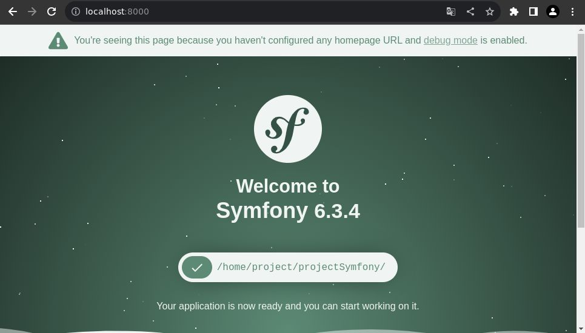
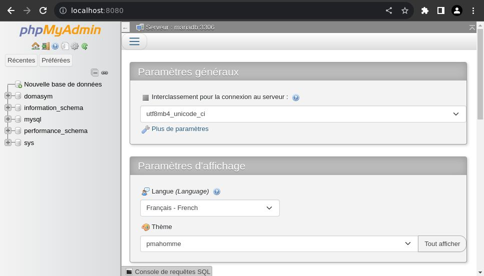
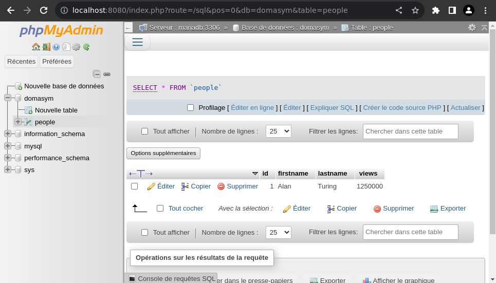

# domasym (DOcker MAriadb SYMfony)
Version 1.0.0

<details>
  <summary>Table des matières</summary>
  <ol>
    <li>
        <a href="#présentation">Présentation</a>
        <ul>
            <li><a href="#l-avantage-d-utiliser-docker">L'avantage d'utiliser docker</a></li>
            <li><a href="#conteneur-symfony">Conteneur symfony</a></li>
            <li><a href="#conteneur-mailhog">Conteneur mailhog</a></li>
            <li><a href="#conteneur-phpmyadmin">Conteneur phpmyadmin</a></li>
            <li><a href="#conteneur-mariadb">Conteneur mariadb</a></li>
            <li><a href="#conteneurs-sgbd">Conteneurs SGBD</a></li>
            <li><a href="#les-fichiers-de-configurations">Les fichiers de configurations</a></li>
        </ul>
    </li>
    <li>
        <a href="#création-du-conteneur-docker">Création du conteneur (Docker)</a>
        <ul>
            <li><a href="#le-fichier-env">Le fichier .env</a></li>
            <li><a href="#modifier-l-adresse-de-port">Modifier l'adresse de port</a></li>
            <li><a href="#installer-le-conteneur">Installer le conteneur</a></li>
            <li><a href="#modifier-le-fichier-d-intallation">Modifier le fichier d'intallation</a></li>
            <li><a href="#modifier-les-versions">Modifier les versions</a></li>
        </ul>
    </li>
    <li><a href="#rechercher-un-package-docker">Rechercher un package (Docker)</a></li>
    <li>
        <a href="#install-un-package-docker">Install un package (Docker)</a>
        <ul>
            <li><a href="#dans-dockerfile">Dans Dockerfile</a></li>
        </ul>
    </li>
    <li><a href="#logs-et-info-conteneur-docker">Logs et info conteneur (Docker)</a></li>
    <li><a href="#le-dossier-du-projet">Le dossier du projet</a></li>
    <li>
        <a href="#mini-projet">Mini projet</a>
        <ul>
            <li><a href="#packages-installés-dans-le-mini-projet">Packages installés dans le mini-projet</a></li>
        </ul>
    </li>
    <li><a href="#les-commandes-angular-dans-le-mini-projet">Les commandes angular dans le mini-projet</a></li>
    <li><a href="#visualiser-les-messages-de-la-console-ou-les-logs">Visualiser les messages de la console ou les logs</a></li>
    <li><a href="#server-start-stop-restart">Server start|stop|restart</a></li>
  </ol>
</details>

## Présentation
La base docker pour un projet en symfony. Ceci est une base, vous pouvez le modifier selon vos besoins.<br />
> [!WARNING]
> Vous devez installer docker pour pouvoir l'utiliser.

<br />
Vous devez placer votre code dans le dossier "**project/www/**". <br /> 

> [!NOTE]
> Le serveur démarre automatique au démarrage du conteneur, vous n'avez normalement pas besoin de le démarrer par vous-même.

### L'avantage d'utiliser docker
Lorsque vous faites un projet avec docker vous devez transmettre la totalité du projet, les fichiers de création des conteneurs et le code. Pour ce projet, vous devez transmettre le contenu en totalité du dossier "**domasym**" (**que vous pouvez et surtout, devez le renommer au nom de votre projet**) dans un git.<br />
Les avantages :<br />
* Pas de programme à installer sur votre pc (à part docker et un éditeur ou IDE)
* Travailler à plusieurs avec les mêmes conteneurs à l'identique
* Prêt à travailler directement sur le code après la création des conteneurs
* Avoir une base prés remplie lors de la création des conteneurs.<sup>(1)</sup>
<br /> Après installation des conteneurs, on peut directement continuer le code.
<sup>(1) [Conteneur mariadb](#conteneur-mariadb)</sup>

### Conteneur symfony
Il est conçu à partir de l'image du [docker php](https://hub.docker.com/_/php).<br />
Il contiendra vos codes.<br />
Il installe aussi dans le conteneur :<br />
* [symfony](https://symfony.com/)

<br />
Il y a plusieurs packages installés, vous pouvez les retrouver dans le fichier "**.docker/phpSymfony/Dockerfile**".

<br /> 
C'est dans ce conteneur que vous allez placer vos codes angular, dans le dossier "**project/www/**" (qui est lié au conteneur).
<br /><br />

### Conteneur mailhog
Il est conçu à partir de l'image du [docker mailhog](https://hub.docker.com/r/mailhog/mailhog/).<br />
Ce conteneur va vous permettre de visualiser les emails transmis par votre projet nodeJS.
<br /><br />

### Conteneur phpmyadmin
Il est conçu à partir de l'image du [docker phpmyadmin](https://hub.docker.com/r/phpmyadmin/phpmyadmin/).<br />
Ce conteneur va vous permettre de visualiser votre base de données mariadb (SQL).
<br /><br />

### Conteneur mariadb
Il est conçu à partir de l'image du [docker mariadb](https://hub.docker.com/_/mariadb).<br />
Ce conteneur contiendra votre base de donnée. Il est possible de visualiser son contenu à partir du [conteneur phpmyadmin](#conteneur-phpmyadmin)<br />
Il est possible d'entrer des tables lors de sa création, pour se faire il faudra récupérer les tables sous format sql et les placer dans un dossier et modifier le fichier "**docker-compose.yml**".<br />
J'ai mis en place un exemple avec la table people "**0001_domasym.sql**" :
```
# start data
- ./.docker/sgbd_data/0001_domasym.sql:/docker-entrypoint-initdb.d/0001_domasym.sql
# stop data
```
<br /><br />

> [!NOTE]
> Vous pouvez changer de SGBD pour un NOSQL. Pour les projet en php on utilise principalement un SGBD SQL.

### Conteneurs SGBD
Ici je vais présenter quelques conteneurs SGBD et leurs visionneurs sous le format d'un tableau :

| SGBD | visionneur |
| ------------- | ------------- |
| [mariadb](https://hub.docker.com/_/mariadb) | [phpmyadmin](https://hub.docker.com/r/phpmyadmin/phpmyadmin/) |
| [mysql](https://hub.docker.com/_/mysql) | [phpmyadmin](https://hub.docker.com/r/phpmyadmin/phpmyadmin/) |
| [postgres](https://hub.docker.com/_/postgres) | [phppgadmin](https://hub.docker.com/r/dockage/phppgadmin) |
| [mongo](https://hub.docker.com/_/mongo) | [mongo-express](https://hub.docker.com/r/mailhog/mailhog/) |

Ceci est une petite partie des [SGBD](https://fr.wikipedia.org/wiki/Syst%C3%A8me_de_gestion_de_base_de_donn%C3%A9es), vous pouvez vérifier la disponibilité de votre SGBD dans [docker hub](https://hub.docker.com/).

### Les fichiers de configurations
Vous pouvez configurer votre serveur ou le php :
* php.ini : dans le dossier ".docker/php/"
> [!WARNING]
> Si vous modifiez les configurations, il faudra redémarrer le conteneur : " [Server start|stop|restart](#server-start-stop-restart) ". 

## Création du conteneur (Docker)
Vous devez avoir installé Docker. 
Pour la création du conteneur docker pour le projet.
### Le fichier .env
Modifier le contenu du fichier "**.env.example**" :
```
NAME_PROJECT=domasym
NAME_SYMFONY_CONTAINER=domasym_symfony
NAME_MARIABD_CONTAINER=domasym_mariadb
NAME_PHPMYADMIN_CONTAINER=domasym_phpmyadmin
NAME_MAILHOG_CONTAINER=domasym_mailhog
```
Par le nom de votre projet, par exemple 'nameProject' :
```
NAME_PROJECT=nameProject
NAME_SYMFONY_CONTAINER=nameProject_symfony
NAME_MARIABD_CONTAINER=nameProject_mariadb
NAME_PHPMYADMIN_CONTAINER=nameProject_phpmyadmin
NAME_MAILHOG_CONTAINER=nameProject_mailhog
```
Créé un fichier "**.env**" à partir du fichier "**.env.example**" (copier/coller). <br />
> [!WARNING]
> Attention de conserver le fichier "**.env.example**".

### Modifier l'adresse de port
Si vous avez besoin de modifier le port, merci de le faire dans le fichier "**.env**".<br />
> [!WARNING]
> Ne surtout pas le faire dans le fichier "**.env.example**".

<br />
* .env.example : configuration pour tout le monde qui travaille sur le projet
* .env : configuration pour votre pc

<br />Un port de votre pc peut être utilisé par un autre projet, il faudra donc modifier celui-ci. Ce qui est vrai sur un pc, ne le sera pas sur les autres, donc on ne modifit pas les valeurs dans le fichier "**.env.example**".<br />
Il est préférable d'incrémenter à l'identique les ports du projet.<br />
Si je dois incrémenter de 9 un des ports, je le fais aussi pour les autres dans le fichier "**.env**". Ceci évite de se perdre dans les ports disponibles.<br />
Exemple :<br />
```
VALUE_SYMFONY_PORT=8009
VALUE_PHPMYADMIN_PORT=8089
VALUE_MAILHOG_DISPLAY_PORT=8029
```

### Installer le conteneur
Vous pouvez créer votre conteneur.
```
$ ./install.sh
```

### Modifier le fichier d'intallation
Après l'installation, il faudra modifier le contenu du fichier "**install.sh**" :
```
./bin/createProject.sh
#./bin/updateProject.sh
./bin/start.sh
```
Par :
```
#./bin/createProject.sh
./bin/updateProject.sh
./bin/start.sh
```
Si ce n'est pas déjà fait.

### Modifier les versions
> [!WARNING]
> Il est indispensable de le faire pour pouvoir utiliser un conteneur identique des années plus tard. Surtout pour le conteneur qui contient le code.

Sur le projet actuel, on utilise les nouvelles versions ce qui peut poser des problèmes sur le projet par la suite. Il est préférable d'utiliser la version utilisée lors de la création du projet.
<br />
[docker php](https://hub.docker.com/_/php)
<br />
```
$ ./bin/terminal.sh
# php -v
PHP 8.2.10 (cli) (built: Sep  7 2023 06:04:45) (NTS)
# symfony version
Symfony CLI version 5.5.8 (c) 2021-2023 Fabien Potencier
# composer -V
Composer version 2.6.3 2023-09-15 09:38:21
```
Dand le fichier "**.docker/angular/Dockerfile**", remplacé :
```
FROM php:fpm
```
```
FROM php:8.2.10-fpm
```
Pour composer dans le même fichier :
```
COPY --from=composer:latest /usr/bin/composer /usr/bin/composer
```
```
COPY --from=composer:2.6.3 /usr/bin/composer /usr/bin/composer
```

<br />

> [!NOTE]
> Vous n'êtes pas obligé de modifier la version des autres conteneurs.

<br />

Pour modifier la version des autres conteneurs, c'est dans le fichier "**docker-compose.yml**" :
```
VALUE_MARIABD_VERSION=focal
VALUE_PHPMYADMIN_VERSION=latest
VALUE_MAILHOG_VERSION=latest
```
Pour "**focal**", il faudra le remplacer par "**version-focal**".

## Rechercher un package (Docker)
Si vous avez besoin d'un package pour votre projet dans le conteneur. Vous pouvez rechercher les packages disponibles pour le conteneur.
```
$ ./bin/terminal.sh
# apt-cache search name_package
```

## Install un package (Docker)
Si vous avez besoin d'installer un package dans votre conteneur.
```
$ ./bin/terminal.sh
# apt install name_package
```

### Dans Dockerfile
Quand vous installez un package, vous devez aussi le rajouter dans le fichier "**.docker/symfony/Dockerfile**", pour le conserver. Au niveau des "**apt install**".
```
RUN apt install name_package
```

## Logs et info conteneur (Docker)
Vous pouvez avoir besoin de visualiser les logs d'un conteneur si celui-ci ne démarre pas, pour trouver le problème par exemple. Pour ce faire :
```
$ ./bin/container_logs.sh
Options:
   --nodejs
   --mongo
   --mongo-express
   --mailhog
   --helps
   [id ou nom du conteneur]
$ ./bin/container_logs.sh --nodejs
```
Vous pouvez avoir besoin d'information sur l'un des conteneurs, pour trouver sa version par exemple. Pour ce faire :
```
$ ./bin/container_info.sh 
Options:
   --nodejs
   --mongo
   --mongo-express
   --mailhog
   --helps
   [id ou nom du conteneur]
$ ./bin/container_info.sh --mailhog
```
<br />
> [!WARNING]
> Il contient beaucoup d'information sous un format json et ce n'est pas facile de le lire sur le terminal, il est préférable de le mettre dans un fichier json.
<br />
Pour mettre les informations dans un fichier json :
```
$ ./bin/container_info.sh --mailhog >> mailhog_info.json
```

## Le dossier du projet
Votre code devra être placé dans le dossier "**project/www**".

## Mini-projet
Il y a un mini-projet symphony pour vous montrer un exemple, mais vous pouvez le retirer en suppriment le dossier "**project/www**".<br />
> [!WARNING]
> Ne surtout pas supprimer le fichier "**.gitignore**" du dossier "**project**".<br />
> Ne surtout pas supprimer le fichier "**.env.local.example**" du dossier "**project**".
<br />

Lors de l'installation, il démarre le serveur symphony du mini-projet sur '**localhost:8000**' si vous n'avez pas modifié le port (sinon il faut modifier le numéro de port du lien) :
<br /><br />
Vous pouvez modifier le nom du dossier du projet dans le fichier "**.env.example**" et aussi dans le fichier "**.env**" :
```
FOLDER_PROJECT_SYMFONY=www
```
> [!NOTE]
> Il est préférable de conserver ce nom.

<br />

### Packages installés dans le mini-projet
Lors de la création du projet, il y a l'installation de package que vous pouvez retrouver dans le fichier "**./bin/createProject.sh**"
```
docker exec $NAME_SYMFONY_CONTAINER bash -c "cd $FOLDER_PROJECT_SYMFONY/ && composer require symfony/mailer"
docker exec $NAME_SYMFONY_CONTAINER bash -c "cd $FOLDER_PROJECT_SYMFONY/ && composer require symfony/sendgrid-mailer"
docker exec $NAME_SYMFONY_CONTAINER bash -c "cd $FOLDER_PROJECT_SYMFONY/ && composer require symfony/maker-bundle --dev"
docker exec $NAME_SYMFONY_CONTAINER bash -c "cd $FOLDER_PROJECT_SYMFONY/ && composer require symfony/orm-pack --dev --with-all-dependencies"
```
> [!NOTE]
> Vous pouvez les retirer si vous en avez pas besoin.

## Les commandes symfony dans le mini-projet
Vous allez avoir besoin de faire des commandes symfony sur votre code, pour ce faire :
```
$ ./bin/terminal.sh
# cd www/
# symfony console make:controller BrandNewController
```

## Visualiser les messages de la console ou les logs
Les messages de la console sont transmis dans un fichier et ne sont pas visibles sur le terminal.<br />
* Message sur la console dans le fichier : "**projecttmp/logs/symfony/symfony_out.log**".
* Message d'erreur sur la console dans le fichier : "**projecttmp/logs/symfony/symfony_error.log**".

## Server start|stop|restart
Vous pouvez avoir besoin de redémarrer votre serveur, il est possible de le faire facilement avec une commande :
```
$ ./bin/server.sh 
Options:
   start
   stop
   restart
   reload
   log
   --helps
$ ./bin/server.sh start
$ ./bin/server.sh stop
$ ./bin/server.sh restart
```
